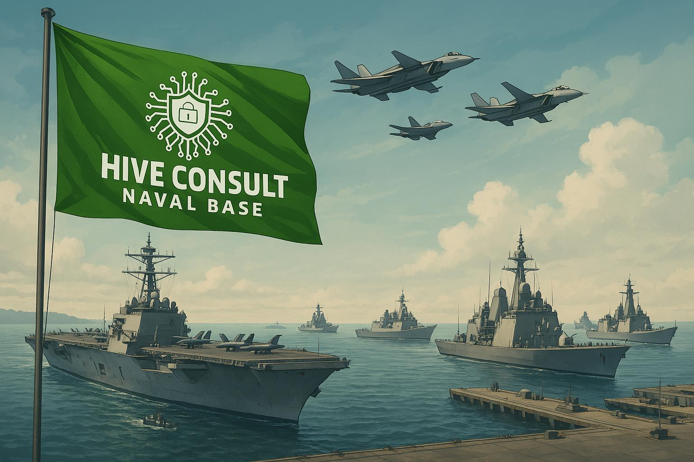

# 🚢 Hive Naval Command System




Welcome aboard, Mate! This is the **Hive Naval Command System** - a deliberately vulnerable naval management platform designed for security training.

## 🎯 System Overview

A PHP web application that manages naval officers with more holes than Swiss cheese! Features include:

- Admin dashboard with ✨easter eggs✨
- Officer database (with built-in IDOR vulnerabilities)
- Mission reporting system (perfect for leaking classified docs)
- "Security" logging (that logs to /dev/null)

## ⚓ System Features

- Fleet deployment tracking
- Officer management portal
- Mission planning interface
- "Totally secure" admin dashboard
- Easter eggs galore!

## 🏴‍☠️ Getting Started

```bash
#Give setup.sh necessary permission to run
sudo chmod +x setup.sh

# Run the setup script USING SUDO
sudo ./setup.sh
```

## 🕵️‍♂️ Hidden Vulnerabilities

The system contains intentional security issues including:

- Authentication bypasses
- Debug information leaks
- SQL injection points
- CSRF vulnerabilities
- Privilege escalation paths

Can you find them all?

## 1. 🎣 Phishy Admin Access

The dashboard has a secret handshake! Type "admin please" in any input field to reveal:

```
Username: admin
Password: *********
```

## 🎮 Easter Eggs & Backdoors

Try these secret access methods:

1. Login with `carl` / `ilovemywife`
2. Backup page code: `1337`
3. Konami code: ↑↑↓↓←→←→BA
4. Right-click the admin dashboard
5. Find the self-destruct sequence!

## ⚠️ Safety Notice

This system is intentionally vulnerable!

🚨 **DO NOT DEPLOY IN PRODUCTION** 🚨

Designed for:

- Security education
- Vulnerability demonstration
- Ethical hacking practice

## Default Credential (Shhh! 🤫)

```
Officers: carl/ilovemywife
```

## 📜 License

This project sails under the [Dangerous Waters License](LICENSE) - use at your own risk!

```
   ____
 _/____\_ 
(  'NAVAL' )
 \______/
   |  |
   |__|
  /    \
 /      \
/        \
